# Diagramas dos Padrões

Diagramas de classe (Mermaid) dos 23 padrões GoF. GitHub renderiza diretamente.

---

## Criacionais

### Singleton

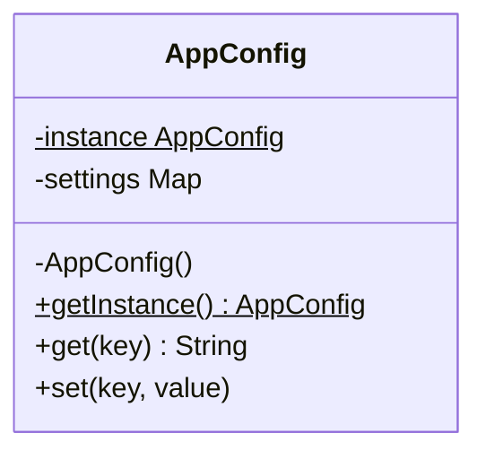
```mermaid
classDiagram
    class AppConfig {
        -instance AppConfig$
        -settings Map
        -AppConfig()
        +getInstance() AppConfig$
        +get(key) String
        +set(key, value)
    }
```

### Factory Method

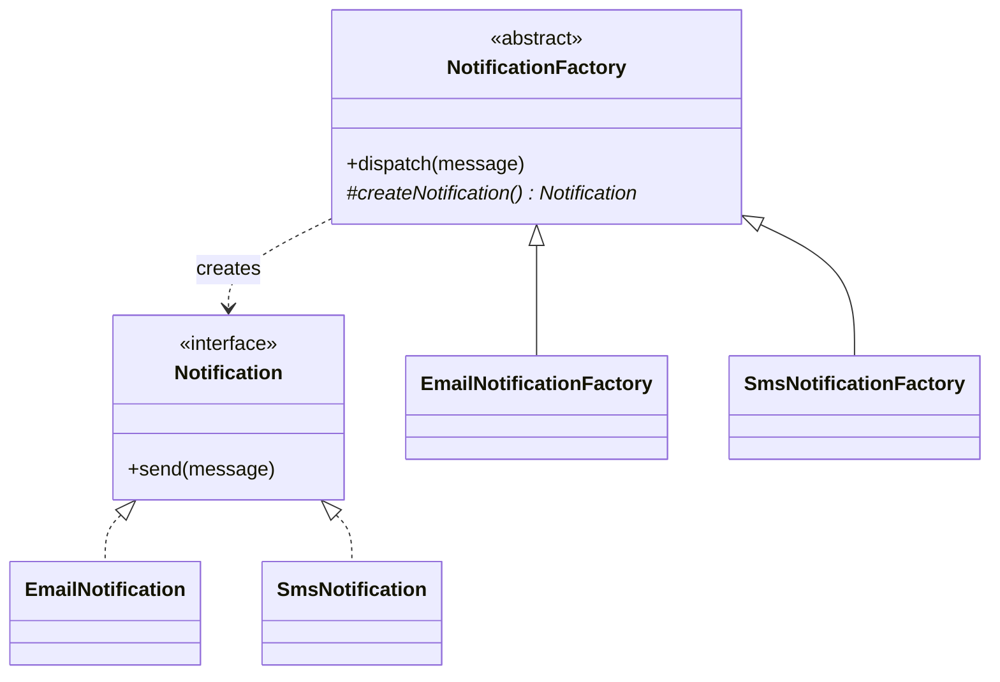
```mermaid
classDiagram
    class Notification {
        <<interface>>
        +send(message)
    }
    class EmailNotification
    class SmsNotification
    class NotificationFactory {
        <<abstract>>
        +dispatch(message)
        #createNotification()* Notification
    }
    class EmailNotificationFactory
    class SmsNotificationFactory
    Notification <|.. EmailNotification
    Notification <|.. SmsNotification
    NotificationFactory <|-- EmailNotificationFactory
    NotificationFactory <|-- SmsNotificationFactory
    NotificationFactory ..> Notification : creates
```

### Abstract Factory

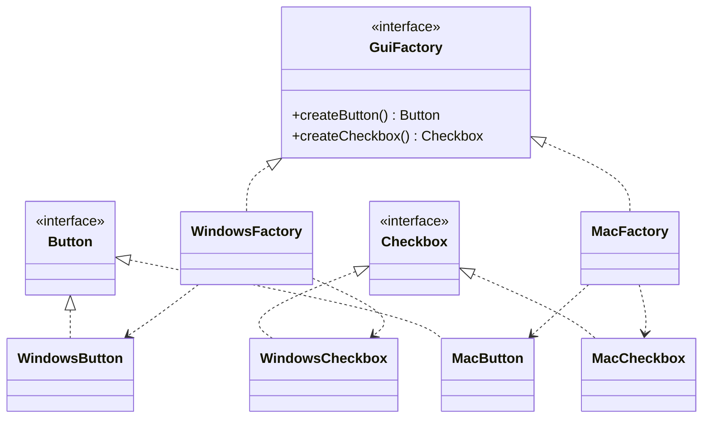
```mermaid
classDiagram
    class GuiFactory {
        <<interface>>
        +createButton() Button
        +createCheckbox() Checkbox
    }
    class Button {
        <<interface>>
    }
    class Checkbox {
        <<interface>>
    }
    class WindowsFactory
    class MacFactory
    class WindowsButton
    class MacButton
    class WindowsCheckbox
    class MacCheckbox
    GuiFactory <|.. WindowsFactory
    GuiFactory <|.. MacFactory
    Button <|.. WindowsButton
    Button <|.. MacButton
    Checkbox <|.. WindowsCheckbox
    Checkbox <|.. MacCheckbox
    WindowsFactory ..> WindowsButton
    WindowsFactory ..> WindowsCheckbox
    MacFactory ..> MacButton
    MacFactory ..> MacCheckbox
```

### Builder

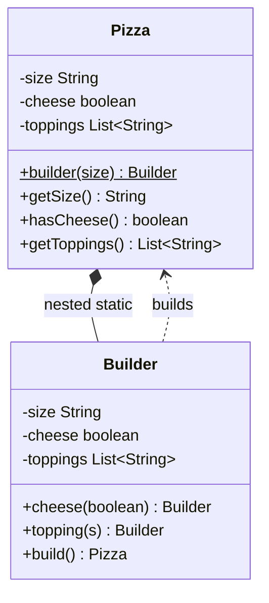
```mermaid
classDiagram
    class Pizza {
        -size String
        -cheese boolean
        -toppings List~String~
        +builder(size)$ Builder
        +getSize() String
        +hasCheese() boolean
        +getToppings() List~String~
    }
    class Builder {
        -size String
        -cheese boolean
        -toppings List~String~
        +cheese(boolean) Builder
        +topping(s) Builder
        +build() Pizza
    }
    Pizza *-- Builder : nested static
    Builder ..> Pizza : builds
```

### Prototype

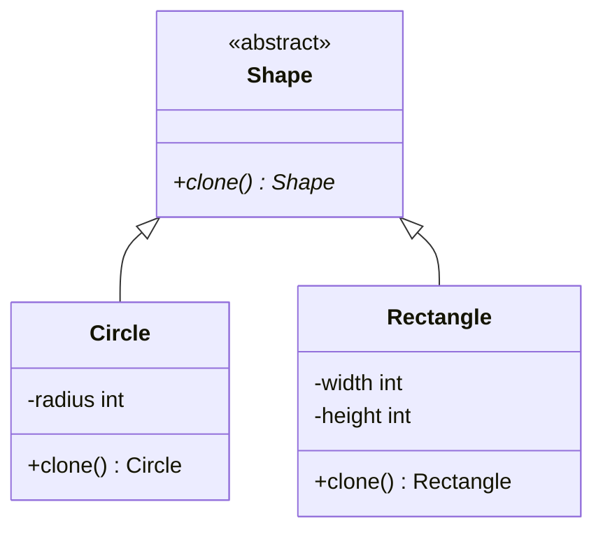
```mermaid
classDiagram
    class Shape {
        <<abstract>>
        +clone()* Shape
    }
    class Circle {
        -radius int
        +clone() Circle
    }
    class Rectangle {
        -width int
        -height int
        +clone() Rectangle
    }
    Shape <|-- Circle
    Shape <|-- Rectangle
```

---

## Estruturais

### Adapter

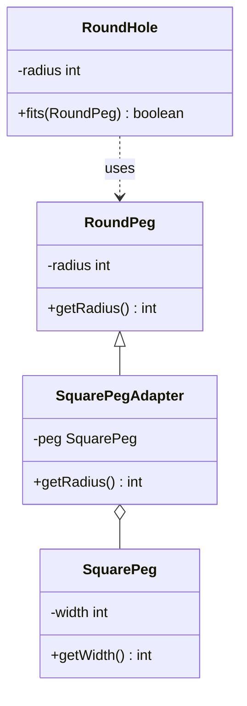
```mermaid
classDiagram
    class RoundHole {
        -radius int
        +fits(RoundPeg) boolean
    }
    class RoundPeg {
        -radius int
        +getRadius() int
    }
    class SquarePeg {
        -width int
        +getWidth() int
    }
    class SquarePegAdapter {
        -peg SquarePeg
        +getRadius() int
    }
    RoundPeg <|-- SquarePegAdapter
    SquarePegAdapter o-- SquarePeg
    RoundHole ..> RoundPeg : uses
```

### Bridge

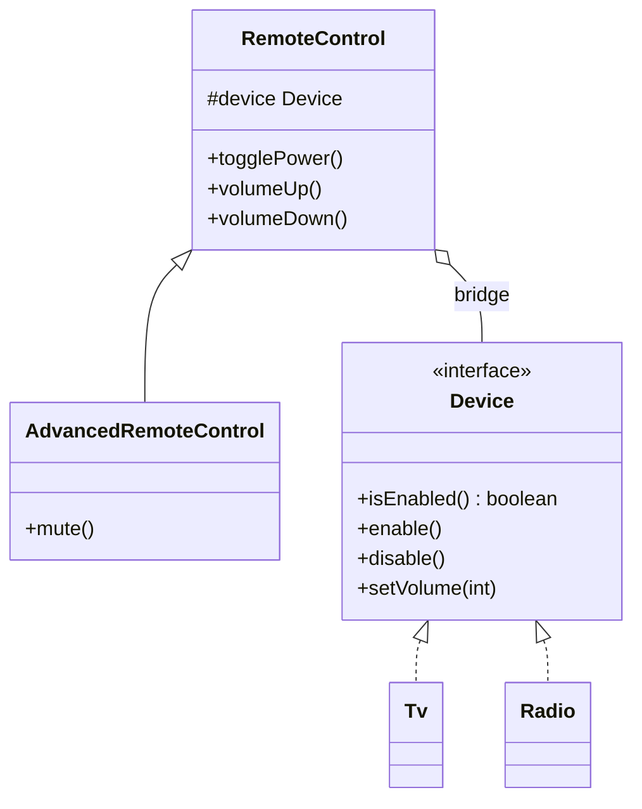
```mermaid
classDiagram
    class RemoteControl {
        #device Device
        +togglePower()
        +volumeUp()
        +volumeDown()
    }
    class AdvancedRemoteControl {
        +mute()
    }
    class Device {
        <<interface>>
        +isEnabled() boolean
        +enable()
        +disable()
        +setVolume(int)
    }
    class Tv
    class Radio
    RemoteControl <|-- AdvancedRemoteControl
    RemoteControl o-- Device : bridge
    Device <|.. Tv
    Device <|.. Radio
```

### Composite

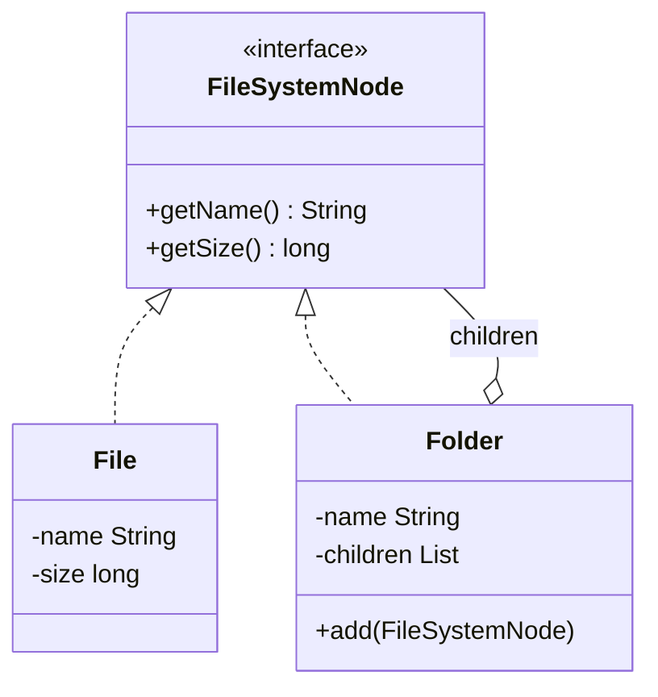
```mermaid
classDiagram
    class FileSystemNode {
        <<interface>>
        +getName() String
        +getSize() long
    }
    class File {
        -name String
        -size long
    }
    class Folder {
        -name String
        -children List
        +add(FileSystemNode)
    }
    FileSystemNode <|.. File
    FileSystemNode <|.. Folder
    Folder o-- FileSystemNode : children
```

### Decorator

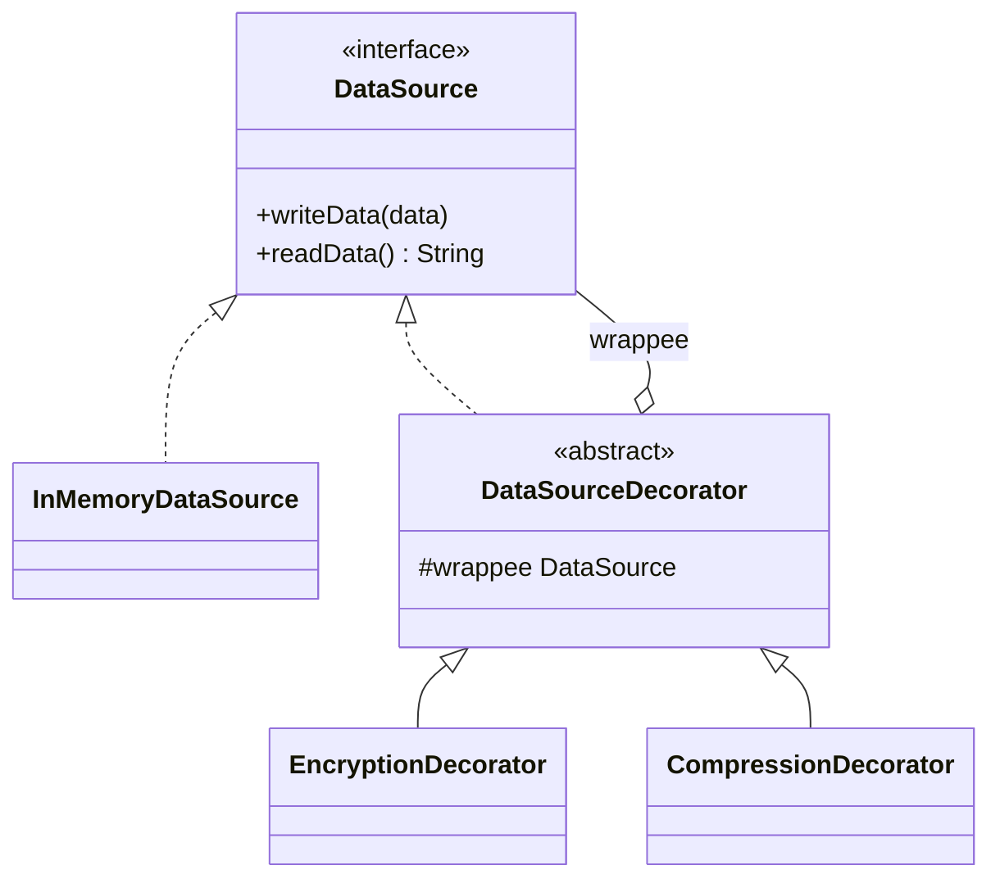
```mermaid
classDiagram
    class DataSource {
        <<interface>>
        +writeData(data)
        +readData() String
    }
    class InMemoryDataSource
    class DataSourceDecorator {
        <<abstract>>
        #wrappee DataSource
    }
    class EncryptionDecorator
    class CompressionDecorator
    DataSource <|.. InMemoryDataSource
    DataSource <|.. DataSourceDecorator
    DataSourceDecorator <|-- EncryptionDecorator
    DataSourceDecorator <|-- CompressionDecorator
    DataSourceDecorator o-- DataSource : wrappee
```

### Facade

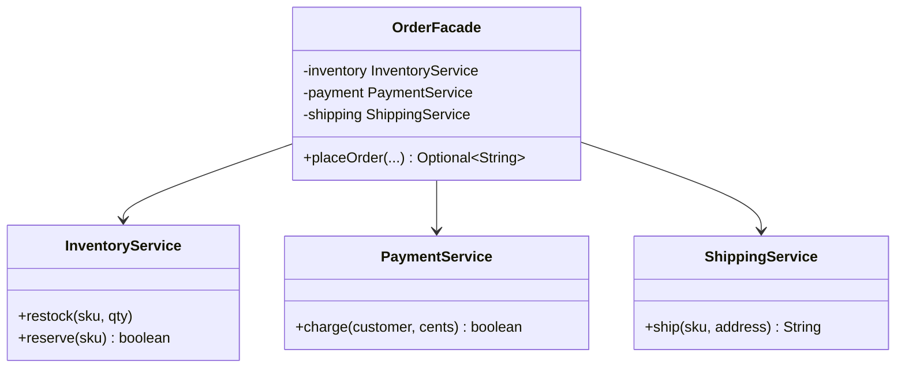
```mermaid
classDiagram
    class OrderFacade {
        -inventory InventoryService
        -payment PaymentService
        -shipping ShippingService
        +placeOrder(...) Optional~String~
    }
    class InventoryService {
        +restock(sku, qty)
        +reserve(sku) boolean
    }
    class PaymentService {
        +charge(customer, cents) boolean
    }
    class ShippingService {
        +ship(sku, address) String
    }
    OrderFacade --> InventoryService
    OrderFacade --> PaymentService
    OrderFacade --> ShippingService
```

### Flyweight

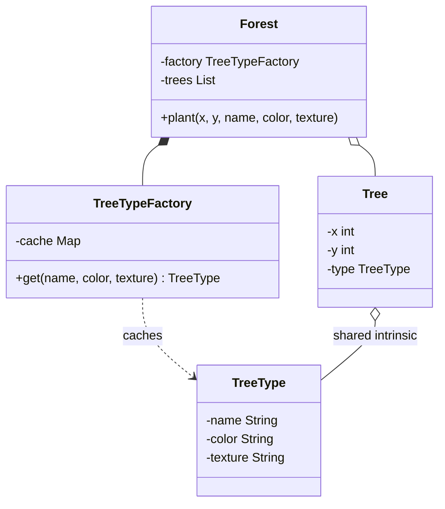
```mermaid
classDiagram
    class TreeType {
        -name String
        -color String
        -texture String
    }
    class TreeTypeFactory {
        -cache Map
        +get(name, color, texture) TreeType
    }
    class Tree {
        -x int
        -y int
        -type TreeType
    }
    class Forest {
        -factory TreeTypeFactory
        -trees List
        +plant(x, y, name, color, texture)
    }
    TreeTypeFactory ..> TreeType : caches
    Tree o-- TreeType : shared intrinsic
    Forest o-- Tree
    Forest *-- TreeTypeFactory
```

### Proxy

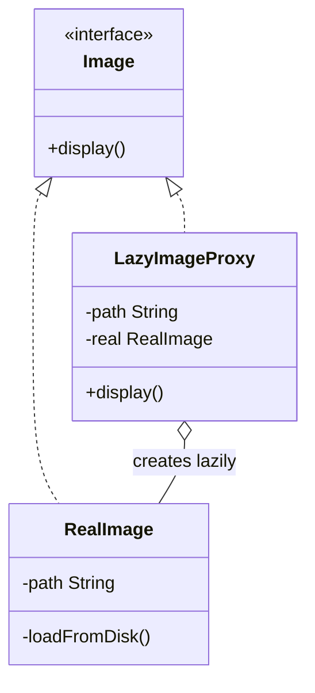
```mermaid
classDiagram
    class Image {
        <<interface>>
        +display()
    }
    class RealImage {
        -path String
        -loadFromDisk()
    }
    class LazyImageProxy {
        -path String
        -real RealImage
        +display()
    }
    Image <|.. RealImage
    Image <|.. LazyImageProxy
    LazyImageProxy o-- RealImage : creates lazily
```

---

## Comportamentais

### Chain of Responsibility

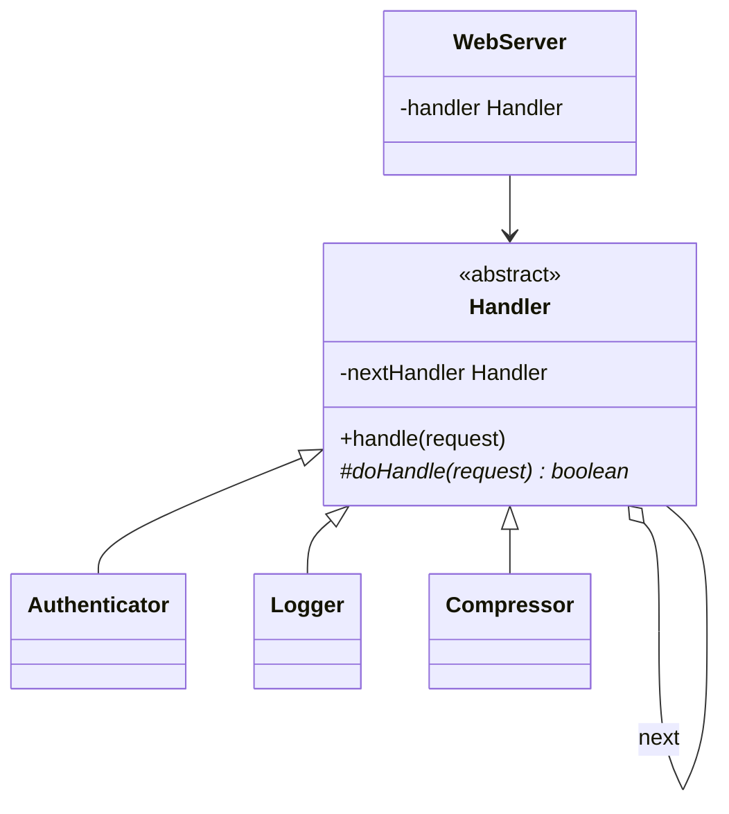
```mermaid
classDiagram
    class Handler {
        <<abstract>>
        -nextHandler Handler
        +handle(request)
        #doHandle(request)* boolean
    }
    class Authenticator
    class Logger
    class Compressor
    class WebServer {
        -handler Handler
    }
    Handler <|-- Authenticator
    Handler <|-- Logger
    Handler <|-- Compressor
    Handler o-- Handler : next
    WebServer --> Handler
```

### Command

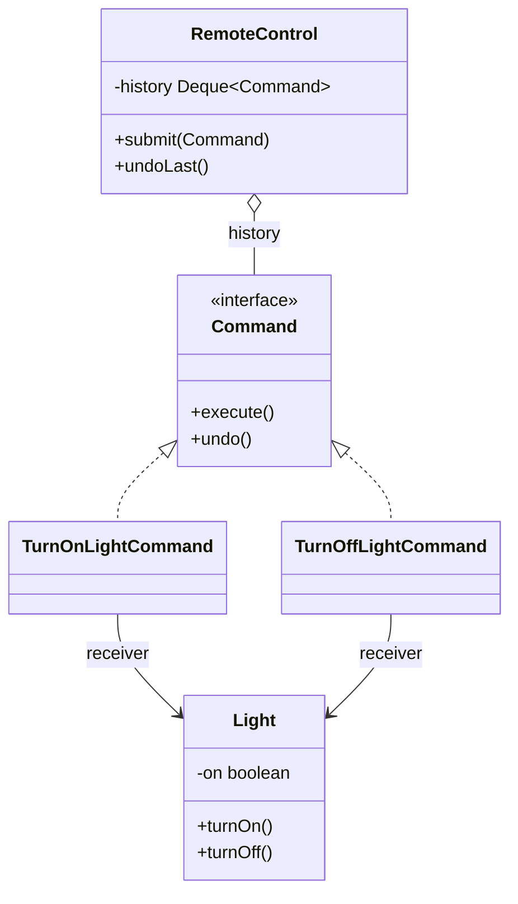
```mermaid
classDiagram
    class Command {
        <<interface>>
        +execute()
        +undo()
    }
    class TurnOnLightCommand
    class TurnOffLightCommand
    class Light {
        -on boolean
        +turnOn()
        +turnOff()
    }
    class RemoteControl {
        -history Deque~Command~
        +submit(Command)
        +undoLast()
    }
    Command <|.. TurnOnLightCommand
    Command <|.. TurnOffLightCommand
    TurnOnLightCommand --> Light : receiver
    TurnOffLightCommand --> Light : receiver
    RemoteControl o-- Command : history
```

### Interpreter

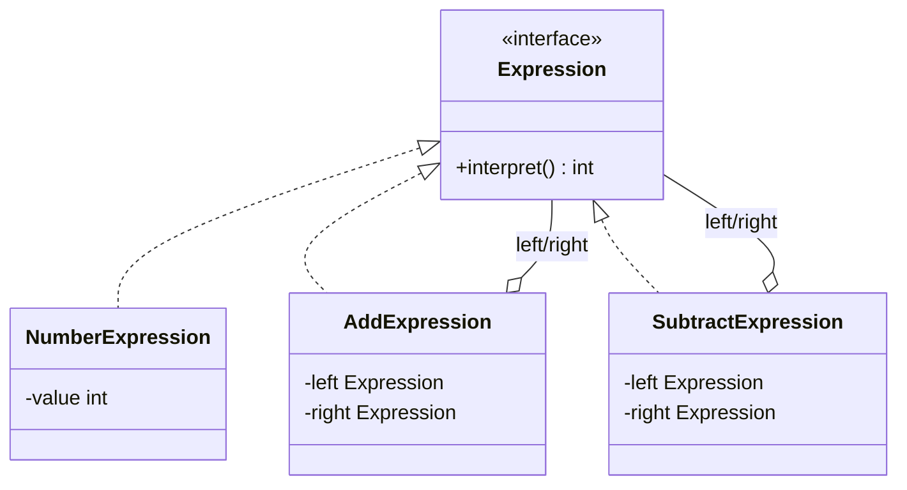
```mermaid
classDiagram
    class Expression {
        <<interface>>
        +interpret() int
    }
    class NumberExpression {
        -value int
    }
    class AddExpression {
        -left Expression
        -right Expression
    }
    class SubtractExpression {
        -left Expression
        -right Expression
    }
    Expression <|.. NumberExpression
    Expression <|.. AddExpression
    Expression <|.. SubtractExpression
    AddExpression o-- Expression : left/right
    SubtractExpression o-- Expression : left/right
```

### Iterator

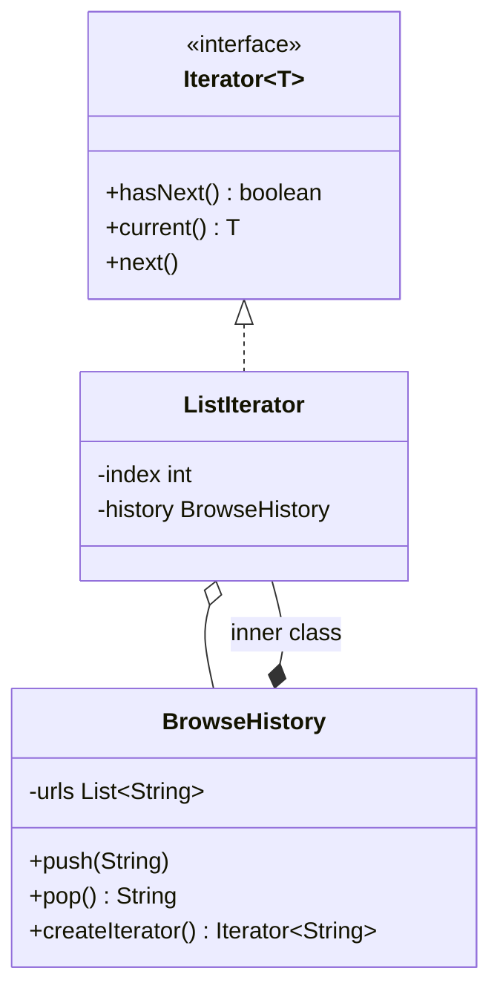
```mermaid
classDiagram
    class Iterator~T~ {
        <<interface>>
        +hasNext() boolean
        +current() T
        +next()
    }
    class BrowseHistory {
        -urls List~String~
        +push(String)
        +pop() String
        +createIterator() Iterator~String~
    }
    class ListIterator {
        -index int
        -history BrowseHistory
    }
    Iterator <|.. ListIterator
    BrowseHistory *-- ListIterator : inner class
    ListIterator o-- BrowseHistory
```

### Mediator

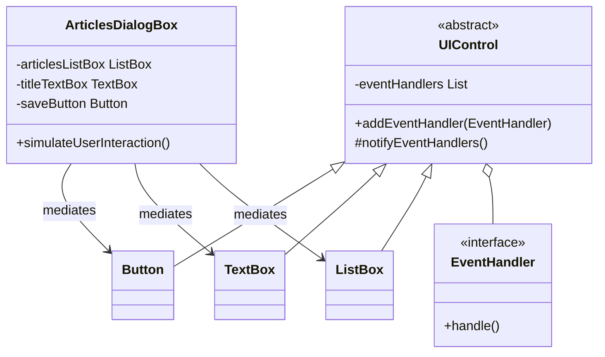
```mermaid
classDiagram
    class ArticlesDialogBox {
        -articlesListBox ListBox
        -titleTextBox TextBox
        -saveButton Button
        +simulateUserInteraction()
    }
    class UIControl {
        <<abstract>>
        -eventHandlers List
        +addEventHandler(EventHandler)
        #notifyEventHandlers()
    }
    class Button
    class TextBox
    class ListBox
    class EventHandler {
        <<interface>>
        +handle()
    }
    UIControl <|-- Button
    UIControl <|-- TextBox
    UIControl <|-- ListBox
    UIControl o-- EventHandler
    ArticlesDialogBox --> Button : mediates
    ArticlesDialogBox --> TextBox : mediates
    ArticlesDialogBox --> ListBox : mediates
```

### Memento

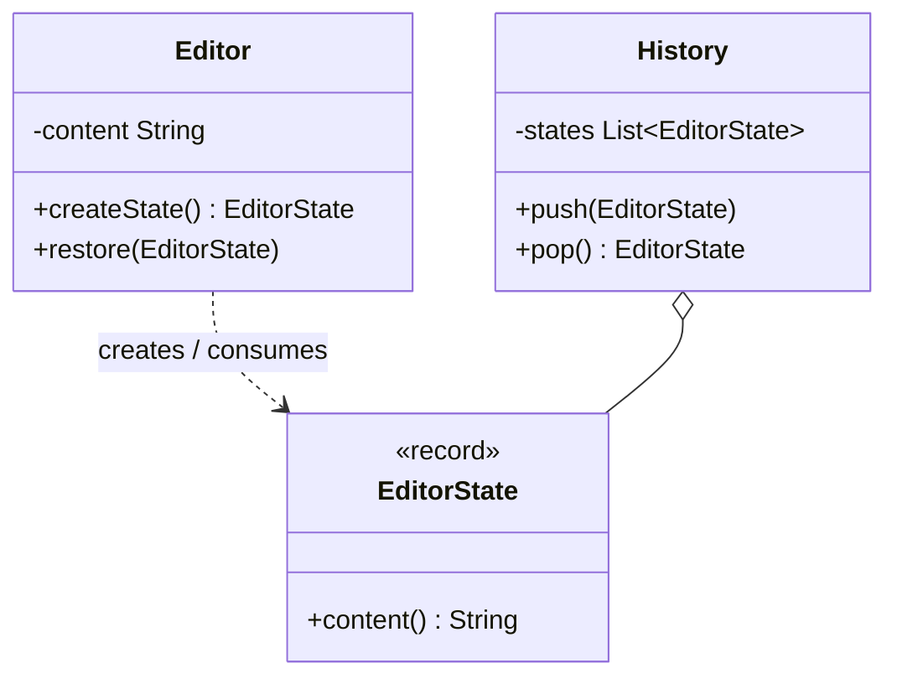
```mermaid
classDiagram
    class Editor {
        -content String
        +createState() EditorState
        +restore(EditorState)
    }
    class EditorState {
        <<record>>
        +content() String
    }
    class History {
        -states List~EditorState~
        +push(EditorState)
        +pop() EditorState
    }
    Editor ..> EditorState : creates / consumes
    History o-- EditorState
```

### Observer

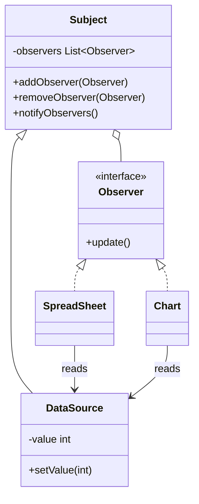
```mermaid
classDiagram
    class Subject {
        -observers List~Observer~
        +addObserver(Observer)
        +removeObserver(Observer)
        +notifyObservers()
    }
    class DataSource {
        -value int
        +setValue(int)
    }
    class Observer {
        <<interface>>
        +update()
    }
    class SpreadSheet
    class Chart
    Subject <|-- DataSource
    Observer <|.. SpreadSheet
    Observer <|.. Chart
    Subject o-- Observer
    SpreadSheet --> DataSource : reads
    Chart --> DataSource : reads
```

### State

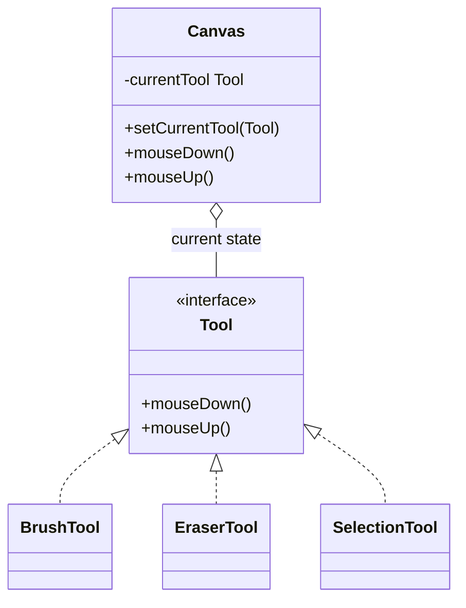
```mermaid
classDiagram
    class Canvas {
        -currentTool Tool
        +setCurrentTool(Tool)
        +mouseDown()
        +mouseUp()
    }
    class Tool {
        <<interface>>
        +mouseDown()
        +mouseUp()
    }
    class BrushTool
    class EraserTool
    class SelectionTool
    Tool <|.. BrushTool
    Tool <|.. EraserTool
    Tool <|.. SelectionTool
    Canvas o-- Tool : current state
```

### Strategy

```mermaid
classDiagram
    class ImageStorage {
        +store(file, Compressor, Filter)
    }
    class Compressor {
        <<interface>>
        +compress(file)
    }
    class Filter {
        <<interface>>
        +apply(file)
    }
    class JpegCompressor
    class PngCompressor
    class BlackAndWhiteFilter
    class HighContrastFilter
    Compressor <|.. JpegCompressor
    Compressor <|.. PngCompressor
    Filter <|.. BlackAndWhiteFilter
    Filter <|.. HighContrastFilter
    ImageStorage ..> Compressor : injected
    ImageStorage ..> Filter : injected
```

### Template Method

```mermaid
classDiagram
    class Task {
        <<abstract>>
        -auditTrail AuditTrail
        +execute()
        #doExecute()*
    }
    class TransferMoneyTask
    class GenerateReportTask
    class AuditTrail {
        +recordTrail()
    }
    Task <|-- TransferMoneyTask
    Task <|-- GenerateReportTask
    Task o-- AuditTrail
```

### Visitor

```mermaid
classDiagram
    class HtmlNode {
        <<interface>>
        +execute(Operation)
    }
    class HeadingNode
    class AnchorNode
    class Operation {
        <<interface>>
        +apply(HeadingNode)
        +apply(AnchorNode)
    }
    class PlainTextOperation
    class HighlightOperation
    class HtmlDocument {
        -nodes List
        +add(HtmlNode)
        +execute(Operation)
    }
    HtmlNode <|.. HeadingNode
    HtmlNode <|.. AnchorNode
    Operation <|.. PlainTextOperation
    Operation <|.. HighlightOperation
    HtmlDocument o-- HtmlNode
    HtmlNode ..> Operation : double dispatch
```
